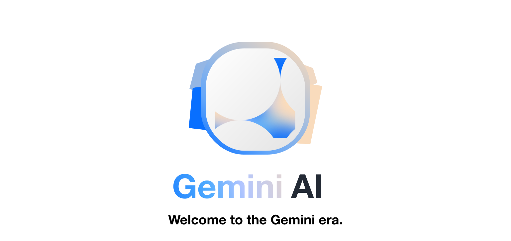

<picture>

  <source media="(prefers-color-scheme: dark)" srcset="../assets/banner@dark.svg">
  <source media="(prefers-color-scheme: light)" srcset="../assets/banner@light.svg">
  
</picture>
<p align="center">
  <a aria-label="NPM Version" href="https://www.npmjs.com/package/gemini-ai">
    
  </a>
  <a aria-label="NPM Download Count" href="https://www.npmjs.com/package/gemini-ai">
    
  </a>
  <a aria-label="palm-api Size" href="https://www.npmjs.com/package/gemini-ai">
    
  </a>
</p>
<p align="center">
  <a href="#documentation">Docs</a> | <a href="https://github.com/evanzhoudev/gemini-ai">GitHub</a> | <a href="#faq">FAQ</a>
</p>

> [!NOTE]  
> With the release of Gemini AI 1.1, there is now **streaming support**! Check it out [here](#streaming).

## Features

- 🌎 [**Multimodal**](#auto-model-selection): Interact with text and images—Native to the model.
- 🌐 [**Contextual Conversations**](#geminicreatechat): Chat with Gemini, built in.
- 🧪 [**Parameter**](#method-patterns): Easily modify `temperature`, `topP`, and more
- ⛓️ [**Streaming**](#streaming): Get AI output the second it's available.

## Highlights

Gemini AI v1.0 compared to Google's [own API](https://www.npmjs.com/package/@google/generative-ai)

- ⚡ [**Native REST API**](#inititalization): Have simplicity without compromises
- 🚀 [**Easy**](#feature-highlight-auto-model-selection): Auto model selection based on context
- 🎯 [**Concise**](#why-gemini-ai): _**4x**_ less code needed

## Table of Contents

- [**Getting an API Key**](#getting-an-api-key)
- [**Quickstart**](#quickstart)
- [**Special Features**](#special-features)
- [**Documentation**](#documentation)
  - [Initialization](#inititalization)
  - [Method Patterns](#method-patterns)
  - [`Gemini.ask()` Method](#geminiask)
  - [`Gemini.count()` Method](#geminicount)
  - [`Gemini.embed()` Method](#geminiembed)
  - [`Gemini.createChat()` Method](#geminicreatechat)
- [**FAQ**](#faq)
- [**Contributors**](#contributors)

## Getting an API Key

1. Go to [Google Makersuite](https://makersuite.google.com)
2. Click "Get API key" at the top, and follow the steps to get your key
3. Copy this key, and use it below when `API_KEY` is mentioned.

> [!CAUTION]
> Do not share this key with other people! It is recommended to store it in a `.env` file.

## Quickstart

Make a text request (`gemini-pro`):

```javascript
import Gemini from "gemini-ai";

const gemini = new Gemini(API_KEY);

console.log(await gemini.ask("Hi!"));
```

Make a streaming text request (`gemini-pro`):

```javascript
import Gemini from "gemini-ai";

const gemini = new Gemini(API_KEY);

gemini.ask("Hi!", {
	stream: console.log,
});
```

Chat with Gemini (`gemini-pro`):

```javascript
import fs from "fs";

const gemini = new Gemini(API_KEY);
const chat = gemini.createChat();

console.log(await chat.ask("Hi!"));
console.log(await chat.ask("What's the last thing I said?"));
```

### Other useful features

<details>
<summary>Make a text request with images (<code>gemini-pro-vision</code>):</summary>
<br>

```javascript
import fs from "fs";
import Gemini from "gemini-ai";

const gemini = new Gemini(API_KEY);

console.log(
	gemini.ask("What's this show?", {
		data: [fs.readFileSync("./test.png")],
	})
);
```

</details>

<details>
<summary>Make a text request with custom parameters (<code>gemini-pro</code>):</summary>
<br>

```javascript
import Gemini from "gemini-ai";

const gemini = new Gemini(API_KEY);

console.log(
	gemini.ask("Hello!", {
		temperature: 0.5,
		topP: 1,
		topK: 10,
	})
);
```

</details>

<details>
<summary>Embed Text (<code>`embedding-001`</code>):</summary>
<br>

```javascript
import fs from "fs";

const gemini = new Gemini(API_KEY);

gemini.embed("Hi!");
```

</details>

## Special Features

### Auto Model Selection

Google has released two models this time for Gemini—`gemini-pro`, and `gemini-pro-vision`. The former is text-specific, while the latter is for multimodal use. Gemini AI has been designed so that it will automatically select which model it will use!

### Streaming

Here's a quick demo:

```javascript
import Gemini from "gemini-ai";

const gemini = new Gemini(API_KEY);

gemini.ask("Write an essay", {
	stream: (x) => process.stdout.write(x),
});
```

Let's walk through what this code is doing. Like always, we first initialize `Gemini`. Then, we call the `ask` function, and provide a `stream` config. This callback will be invoked whenever there is new content coming in from Gemini!

Note that this automatically cuts to the `streamContentGenerate` command... you don't have to worry about that!

> [!NOTE]  
> Realize that you don't need to call `ask` async if you're handling stream management on your own. If you want to tap the final answer, it still is returned by the method, and you call it async as normal.

### Proxy Support

Use a proxy when fetching from Gemini. To keep package size down and adhere to the [SRP](https://en.wikipedia.org/wiki/Single_responsibility_principle), the actual proxy handling is delegated to the [undici library](https://undici.nodejs.org/#/).

Here's how to add a proxy:

Install `undici`:

```bash
npm i undici
```

Initialize it with Gemini AI:

```javascript
import { ProxyAgent } from 'undici'
import Gemini from 'gemini-ai'

let gemini = new Gemini(API_KEY, {
	dispatcher: new ProxyAgent(PROXY_URL)
})
```

And use as normal!

## Documentation

### Inititalization

To start any project, include the following lines:

> [!NOTE]  
> Under the hood, we are just running the Gemini REST API, so there's no fancy authentication going on! Just pure, simple web requests.

```javascript
// Import Gemini AI
import Gemini from "gemini-ai";

// Initialize your key
const gemini = new Gemini(API_KEY);
```

Learn how to add a `fetch` polyfill for the browser [here](#im-in-a-browser-environment-what-do-i-do).

### Method Patterns

All model calling methods have a main parameter first (typically the text as input), and a `config` second, as a JSON. A detailed list of all config can be found along with the method. An example call of a function may look like this:

```javascript
await gemini.ask("Hi!", {
	// Config
	temperature: 0.5,
	topP: 1,
	topK: 10,
});
```

> [!NOTE]  
> All methods are async! This means you should call them something like this: `await gemini.ask(...)`

Note that the output to `Gemini.JSON` varies depending on the model and command, and is not documented here in detail due to the fact that it is unnecessary to use in most scenarios. You can find more information about the REST API's raw output [here](https://ai.google.dev/tutorials/rest_quickstart).

### `Gemini.ask()`

This method uses the `generateContent` command to get Gemini's response to your input.

Config available:
| Field Name | Description | Default Value |
| ------------- | ----------------------------------------------------------------------------------------------------------------------------------------------------------------------------------- | -------------------------- |
| `format` | Whether to return the detailed, raw JSON output. Typically not recommended, unless you are an expert. Can either be `Gemini.JSON` or `Gemini.TEXT` | `Gemini.TEXT` |
| `topP` | See [Google's parameter explanations](https://cloud.google.com/vertex-ai/docs/generative-ai/start/quickstarts/api-quickstart#parameter_definitions) | `0.8` |
| `topK` | See [Google's parameter explanations](https://cloud.google.com/vertex-ai/docs/generative-ai/start/quickstarts/api-quickstart#parameter_definitions) | `10` |
| `temperature` | See [Google's parameter explanations](https://cloud.google.com/vertex-ai/docs/generative-ai/start/quickstarts/api-quickstart#parameter_definitions) | `1` |
| `model` | Which model to use. Can be any model Google has available, but certain features are not available on some models. Currently: `gemini-pro` and `gemini-pro-vision` | Automatic based on Context |
| `maxOutputTokens` | Max tokens to output | `800` |
| `messages` | Array of `[userInput, modelOutput]` pairs to show how the bot is supposed to behave | `[]` |
| `data` | An array of `Buffer`s to input to the model. Automatically toggles model to `gemini-pro-vision` | `[]` |
| `stream` | A function that is called with every new chunk of JSON or Text (depending on the format) that the model receives. [Learn more](#feature-highlight-streaming)| `undefined` |

Example Usage:

```javascript
import Gemini from "gemini-ai";

const gemini = new Gemini(API_KEY);

console.log(
	await gemini.ask("Hello!", {
		temperature: 0.5,
		topP: 1,
		topK: 10,
	})
);
```

### `Gemini.count()`

This method uses the `countTokens` command to figure out the number of tokens _in your input_.

Config available:
| Field Name | Description | Default Value |
| ------------- | ----------------------------------------------------------------------------------------------------------------------------------------------------------------------------------- | -------------------------- |
| `model` | Which model to use. Can be any model Google has available, but reasonably must be `gemini-pro` | Automatic based on Context |

Example Usage:

```javascript
import Gemini from "gemini-ai";

const gemini = new Gemini(API_KEY);

console.log(await gemini.count("Hello!"));
```

### `Gemini.embed()`

This method uses the `embedContent` command (currently **only on `embedding-001`**) to generate an embedding matrix for your input.

Config available:
| Field Name | Description | Default Value |
| ------------- | ----------------------------------------------------------------------------------------------------------------------------------------------------------------------------------- | -------------------------- |
| `model` | Which model to use. Can be any model Google has available, but reasonably must be `embedding-001` | `embedding-001` |

Example Usage:

```javascript
import Gemini from "gemini-ai";

const gemini = new Gemini(API_KEY);

console.log(await gemini.embed("Hello!"));
```

### `Gemini.createChat()`

`Gemini.createChat()` is a unique method. For one, it isn't asynchronously called. Additionally, it returns a brand new `Chat` object. The `Chat` object only has one method, which is `Chat.ask()`, which has the _exact same syntax_ as the `Gemini.ask()` method, documented [above](#geminiask). The only small difference is that most parameters are passed into the `Chat` through `createChat()`, and cannot be overriden by the `ask()` method. The only parameters that can be overridden is `format`, `stream`, and `data` (**As of 12/13/2023, `data` is not supported yet**).

> [!IMPORTANT]  
> Google has not yet allowed the use of the `gemini-pro-vision` model in continued chats yet—The feature is already implemented, to a certain degree, but cannot be used due to Google's API limitations.

All important data in the `Chat` object is stored in the `Chat.messages` variable, and can be used to create a new `Chat` that "continues" the conversation, as will be demoed in the example usage section.

Config available for `createChat`:
| Field Name | Description | Default Value |
| ------------- | ----------------------------------------------------------------------------------------------------------------------------------------------------------------------------------- | -------------------------- |
| `topP` | See [Google's parameter explanations](https://cloud.google.com/vertex-ai/docs/generative-ai/start/quickstarts/api-quickstart#parameter_definitions) | `0.8` |
| `topK` | See [Google's parameter explanations](https://cloud.google.com/vertex-ai/docs/generative-ai/start/quickstarts/api-quickstart#parameter_definitions) | `10` |
| `temperature` | See [Google's parameter explanations](https://cloud.google.com/vertex-ai/docs/generative-ai/start/quickstarts/api-quickstart#parameter_definitions) | `1` |
| `model` | Which model to use. Can be any model Google has available, but certain features are not available on some models. Currently: `gemini-pro` and `gemini-pro-vision` | Automatic based on Context |
| `maxOutputTokens` | Max tokens to output | `800` |
| `messages` | Array of `[userInput, modelOutput]` pairs to show how the bot is supposed to behave | `[]` |

Example Usage:

```javascript
// Simple example:

import Gemini from "gemini-ai";

const gemini = new Gemini(API_KEY);

const chat = gemini.createChat();

console.log(await chat.ask("Hi!"));
console.log(await chat.ask("What's the last thing I said?"));
```

```javascript
// "Continuing" a conversation:

import Gemini from "gemini-ai";

const gemini = new Gemini(API_KEY);

const chat = gemini.createChat();

console.log(await chat.ask("Hi!"));

const newChat = gemini.createChat({
	messages: chat.messages,
});

console.log(await newChat.ask("What's the last thing I said?"));
```

## FAQ

### Why Gemini AI?

Well, simply put, it makes using Gemini just that much easier... see the code necessary to make a request using Google's own API, compared to Gemini AI:

<details>
<summary>See the comparison</summary>
<br>

Google's own API (CommonJS):

```javascript
const { GoogleGenerativeAI } = require("@google/generative-ai");

const genAI = new GoogleGenerativeAI(API_KEY);

async function run() {
	const model = genAI.getGenerativeModel({ model: "gemini-pro" });

	const prompt = "Hi!";

	const result = await model.generateContent(prompt);
	const response = await result.response;
	const text = response.text();
	console.log(text);
}

run();
```

Gemini AI (ES6 Modules):

```javascript
import Gemini from "gemini-ai";

const gemini = new Gemini(API_KEY);
console.log(await gemini.ask("Hi!"));
```

That's nearly 4 times less code!

</details>

### I'm in a browser environment! What do I do?

Everything is optimized so it works for both browsers and Node.js—Files are passed as Buffers, so you decide how to get them, and adding a fetch polyfill is as easy as:

```javascript
import Gemini from "gemini-ai";
import fetch from "node-fetch";

const gemini = new Gemini(API_KEY, {
	fetch: fetch,
});
```

<h2 align="center" id="contributors">Contributors</h2>
<p align="center">A special shoutout to developers of and contributors to the <a href="https://github.com/EvanZhouDev/bard-ai"><code>bard-ai</code></a> and <a href="https://github.com/EvanZhouDev/palm-api"><code>palm-api</code></a> libraries. Gemini AI's interface is heavily based on what we have developed on these two projects.</p>

### I Want more control over the API version

By default the project uses the `v1beta` API version to enable the most features and backwards compatibility. You can read more about it [here](https://ai.google.dev/docs/api_versions).

If you feel the need to use a different version than the default you can pass it as an option on gemini initialization:

```javascript
import Gemini from "gemini-ai";

const gemini = new Gemini(API_KEY, {
	apiVersion: "v1",
});
```
